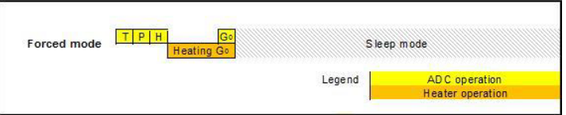
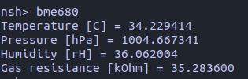

## Writing the driver for the BME680 sensor

Before writing a driver it is important to familiarize yourself with the internals of the sensor by reading its [datasheet](https://www.bosch-sensortec.com/media/boschsensortec/downloads/datasheets/bst-bme680-ds001.pdf).

### What does the BME680 do?
- Performs **temperature, pressure, humidity and gas resistance** measurements.
- **Gas resistance** indicates the presence of [VOCs](https://en.wikipedia.org/wiki/Volatile_organic_compound) (such as CO2) in the air (A low gas resistance means the air is more polluted with VOCs).
- The data can be used for monitoring the quality of indoor air by calculating its **IAQ index**.
  
### Gas sensor working principle
- This is important to know because it affects the way we set up the sensor.
- BME680 uses a **MOX sensor** to detect VOCs in the air. This type of sensor contains a **metal-oxide surface** and a **heater**. As the surface is heated, it reacts with the surrounding gas and changes its conductivity, which is then measured as a resistance.
- The heater in the BME680 usually reaches between 200 to 400 degrees Celsius in a matter of about 100 milliseconds.

### Communicating with the sensor
- Reading and writing from/to the registers inside the sensor is done via **[I2C](https://en.wikipedia.org/wiki/I%C2%B2C)** or **[SPI](https://en.wikipedia.org/wiki/Serial_Peripheral_Interface)**. The logic for this interfacing is done in the ```bme680_getreg8``` and
```bme680_putreg8``` functions, which read/write from/to a register at a certain address in the memory of the sensor.
- On the Sparrow Board, the sensor is communicating over I2C, so the implementation of the driver does not have SPI support yet.
- The **register addresses** can be found in the datasheet and are declared as **macros** in the code, along with masks to isolate data (an 8-bit register can contain multiple types of data, as we will see soon).

### NuttX Sensor Interface
- The code that handles every sensor in NuttX can be found in ```sensor.c``` and ```sensor.h```, where the interfacing of the sensor with the "outside world" is done via calls like open, close, read, write or ioctl (among others). Ultimately, the sensor will be seen as a set of **files** from the user's perspective.
- When writing the driver, we do not directly implement the ```open``` method, but provide an internal method (in our case it is called ```bme680_activate```).
- When we will write ```open``` in our app, it will refer to the sensor general-purpose method found in ```sensor.c```, which will then call ```activate``` from the sensor's lowerhalf, defined in ```bme680.c```.
- Mapping our functions to their roles is done like this (explanations can be found in ```sensor.h```):

    ```c
    static const struct sensor_ops_s g_sensor_ops =
    {
        NULL,                 /* open */
        NULL,                 /* close */
        bme680_activate,      /* activate */
        NULL,                 /* set_interval */
        NULL,                 /* batch */
        NULL,                 /* fetch */
        NULL,                 /* selftest */
        NULL,                 /* set_calibvalue */
        bme680_calibrate,     /* calibrate */
        bme680_control        /* control */
    };
    ```
- The ```bme680_control``` method implements custom ```ioctl``` commands, such as soft reset.
- Our sensor will work by **polling**, so it is not necessary to provide a **fetch** method (the equivalent to read).
- Since each sensor lowerhalf will be seen as a **file**, the interface defines its own **file-specific methods**:
    ```c
    static const struct file_operations g_sensor_fops =
    {
        sensor_open,    /* open  */
        sensor_close,   /* close */
        sensor_read,    /* read  */
        sensor_write,   /* write */
        NULL,           /* seek  */
        sensor_ioctl,   /* ioctl */
        NULL,           /* mmap */
        NULL,           /* truncate */
        sensor_poll     /* poll  */
    };
    ```
#### Delivering the data
- An **important** note is that this sensor is multi-chip, meaning it is made up of multiple sensors.
- When **polling** the sensor, the measurements will be pushed to the upper layer through the  ```push_event``` methods. Each upper layer file has a buffer from which the ```read``` method gets the data.
- For a normal sensor, a single ```push_event(&data)``` would suffice, but in our case we need to send the data separately to reuse the already existing data structs (sensor_temp, sensor_baro, etc).
- This means that our sensor will be seen by the user as **multiple files**, one for each measurement, and the ```poll()``` call will intercept the push events from each of them. Naturally, if one of the files has a push event, the others will too. The data will then be read from each file:  a ```struct sensor_baro``` type data from the ```sensor_baro0```, and so on.
- The implementation of these push events is as follows (inside ```bme680_thread```):
  ```c
  for (int sensor = 0; sensor < BME680_SENSORS_COUNT; sensor++)
  {
    deliver_data[sensor](priv, &data);
  }
  ```
  where ```deliver_data``` is an array holding the ```push``` methods for each sensor lowerhalf:
  ```c
  static const push_data_func deliver_data[BME680_SENSORS_COUNT] =
  {
  #ifndef CONFIG_BME680_DISABLE_PRESS_MEAS
      bme680_push_press_data
  #else
      bme680_push_temp_data
  #endif

  #ifndef CONFIG_BME680_DISABLE_HUM_MEAS
      ,
      bme680_push_hum_data
  #endif

  #ifndef CONFIG_BME680_DISABLE_GAS_MEAS
      ,
      bme680_push_gas_data
  #endif
  };
  ```
- It should be noticed that if the barometer measurement is activated, the temperature push event is not included. That is because the ```sensor_baro``` struct has both the temperature and the pressure included.
### Sensor workflow

#### Sensor modes
- The sensor's default state is **sleep mode**. It is recommended that **register operations** should occur in this mode.
- The measurements are performed in **forced mode**. After a measurement is completed, the sensor automatically returns to **sleep mode**.

#### Calibration data
- As the sensor is powered, it enters sleep mode. The first thing we need to do is read the **calibration data**, which is a set of parameters specific to each device. These parameters are used for computing the **compensated values** of the raw measurements. The method that reads and stores the calibration data is called ```bme680_get_calib_data```.

#### Sensor setup
- To be able to use the sensor, it needs configuring, which is writing the settings to their proper registers.
- The temperature, pressure and humidity measurements are controlled by setting the **[oversampling](https://en.wikipedia.org/wiki/Oversampling)** for each of them. An oversampling of 0x will disable that measurement. An oversampling greater than 1x is used for more accuracy.
- The accuracy of the temperature and pressure measurements is also influenced by enabling/disabling the **[IIR Filter](https://en.wikipedia.org/wiki/Infinite_impulse_response)** of the sensor.
- The **gas measurements** are configured by writing up to 10 **set-points** into the registers and using one of them during a measurement (the number of the set-point used is 
written in ```nb_conv```).
- A **set-point** is made up of an (optional) initial **heater current** (idac_heat), the **target temperature** of the heater (which is written as an initial heater resistance - res_heat) and the **heater duration** (the time in which the heater reaches the target temperature - written in heat_dur). The ```run_gas``` option must also be set for the gas measurement to take place.
- The method taking care of this part is ```bme680_calibrate```, which receives a ```bme680_config_s``` structure that contains the settings. This is how it's called from an app:
    ```c
    struct bme680_config_s config;
    
    /* Oversampling */
    config.temp_os = BME680_OS_2X;
    config.press_os = BME680_OS_16X;
    config.hum_os = BME680_OS_1X;

    config.filter_coef = BME680_FILTER_COEF3;

    config.target_temp = 300;       /* degrees Celsius */      
    config.heater_duration = 100;   /* milliseconds */

    config.nb_conv = 0;             /* Set-point number */

    ret = ioctl(sensor_fd, SNIOC_CALIBRATE, &config);
    ```
- The ```sensor_fd``` can be any of the file descriptors of the sub-sensors: baro_fd, hum_fd, gas_fd, etc, because all these files are linked to the same ```bme680_dev_s``` struct that holds the config data.
#### Measurements
- The sensor measurements are made during what it's called a TPHG cycle:
  
- To start a measurement, all one needs to do is put the sensor into **forced mode**.
- As the picture shows, the gas measurement takes place after heating the hot plate of the sensor.
- After the measurements, the **status registers** of the sensor indicate if the operation was successful:
  - measuring - is set to 1 is the measurement has not completed yet
  - gas_valid - is it is set to 1, the gas measurement is valid
  - heat_stab - if it is set to 1, the heater functioned correctly, otherwise it did not reach its intended temperature.
  - new_data - indicates whether the data has changed or not since the last measurement.

#### Final values
- The raw values are the output of ADCs and need to be turned into values that can be interpreted.
- This is done by the ```calc_<measurement>``` methods, which use the calibration parameters read at the beginning to compensate the raw values from the sensor (the formulas can be found in the datasheet).

#### Registering the sensor
- Every sensor lowerhalf will be registered separately, thus the bme680 as a whole will be represented as multiple files.
- Disabling a certain measurement from the menu will also disable the registering of that sub-sensor. 

#### The sensor thread
- At register time, a thread is created for taking a measurement at a previously set rate (poll interval) and
pushing it to the upper layer.
- The user will poll the sensor in his app, POLLIN being the indicator that a push event has occured and the buffer has data to be read.

### Testing the sensor
- Because this sensor measures gas resistance, it needs time to accomodate to its surroundings for the measurements to be accurate. It is recommended to let it measure for at least 30 minutes before taking the data into consideration.
- To use the sensor in an app, multiple files need to be opened:
  ```c
  baro_fd = open("/dev/uorb/sensor_baro0", O_RDONLY | O_NONBLOCK);
  if (baro_fd < 0)
    {
      ...
    }

  hum_fd = open("/dev/uorb/sensor_humi0", O_RDONLY | O_NONBLOCK);
  if (hum_fd < 0)
    {
     ...
    }

  gas_fd = open("/dev/uorb/sensor_gas0", O_RDONLY | O_NONBLOCK);
  if (gas_fd < 0)
    {
      ...
    }
  ```
- As mentioned before, the barometer also handles the temperature.
- After opening the necessary files, the ```ioctl``` call calibrates the sensor (As shown in **Sensor setup**).
#### Polling the data
- For ease of use, arrays can be declared:
  ```c
  struct pollfd pfds[] = { 
    {.fd = baro_fd, .events = POLLIN},
    {.fd = hum_fd, .events = POLLIN},
    {.fd = gas_fd, .events = POLLIN}};
  
  struct data sensor_data[] = {
    {.data_struct = &baro_data, .data_size = sizeof(struct sensor_baro)},
    {.data_struct = &humi_data, .data_size = sizeof(struct sensor_humi)},
    {.data_struct = &gas_data, .data_size = sizeof(struct sensor_gas)}
  };
  ```
- The polling itself:
  ```c
    while (...) {
      ret = poll(pfds, 3, -1);
      if (ret < 0)
        {
          perror("Could not poll sensor");
          return ret;
        }

      for (int i = 0; i < 3; i++)
        {
          if (pfds[i].revents & POLLIN)
            {
              ret = read(pfds[i].fd, sensor_data[i].data_struct,
                                    sensor_data[i].data_size);
              if (ret != sensor_data[i].data_size)
                {
                  perror("Could not read from sensor");
                  return ret;
                }
            }
        }
    }
  ```
- And finally, printing the data to the user:
  ```c
    printf("Temperature [C] = %f\n", baro_data.temperature);
    printf("Pressure [hPa] = %f\n", baro_data.pressure);
    printf("Humidity [rH] = %f\n", humi_data.humidity);
    printf("Gas resistance [kOhm] = %f\n", gas_data.gas_resistance);
  ```
  which in the console should look like this:

  
- Keep in mind that the measured temperature is a bit higher than the actual ambient temperature because the sensor and the circuit itself heat up.
