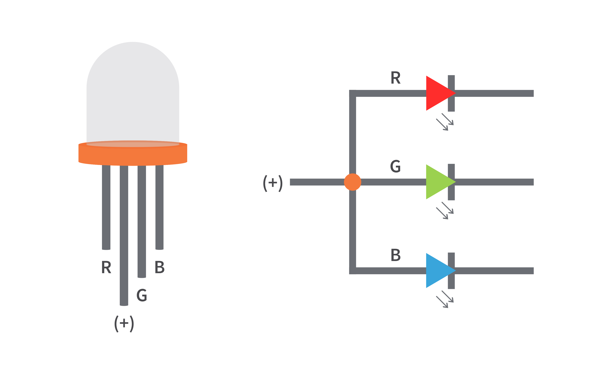

## Adding support for the RGB LED driver on the ESP32 Sparrow Board  

### The basic working principle of RGB LEDs
- An RGB LED is composed of 3 different LEDs, a red, green and blue one, each being controlled independently.


- A common way of controlling the LEDs is through a **[PWM](https://en.wikipedia.org/wiki/Pulse-width_modulation) channel**.
- An RGB color is represented as a group of 3 numbers, ranging from 0 to 255. In our case, 0 corresponds to a 0% duty cycle, while 255 corresponds to a 100% duty cycle. In other words, at 255 the led is at its full power.
- Each PWM channel is linked to a led and by changing its duty cycle we control the led.
- In the image above, the LEDs have a **common anode**, but in practice (as it is the case for the Sparrow board) they could have a **common cathode**, which means the RGB code will need to be **inverted**.

### Writing the ESP32 - RGB driver interface
- Under ```/drivers/leds``` there is ```rgbled.c```, the driver for RGB leds.
- To add support for this to our board, we need to add a few files to the NuttX project and make the necessary configurations.
- When adding a new feature to the board, the starting point is ```esp32-sparrow-kit/src/esp32_bringup.c```, where all the board-specific drivers are initialized.
- The code added to ```esp32_bringup.c``` is the following:
    ```c
    #ifdef CONFIG_RGBLED
    /* Register RGB Driver */
    ret = esp32_rgbled_initialize("/dev/rgbled0");

    if (ret < 0)
    {
        syslog(LOG_ERR, "ERROR: esp32_rgbled_initialize()
        failed:  %d\n", ret);
    }
    #endif
    ```

- The ```CONFIG_RGBLED``` macro is defined at **configuration** time and enables the rgbled driver support.
- The ```esp32_rgbled_initialize``` function contains the registration of the RGB LED driver under the device name of ```/dev/rgbled0```.

### The registration of the RGB driver
- The logic of the ```esp32_rgbled_initialize``` is found inside ```esp32/common/src/esp32_rgbled.c```, because it is common for all esp32 boards and this way code duplication is avoided.
- To be able to use ```esp32_rgbled_initialize``` we also need to declare it inside a header file (```esp32/common/include/esp32_rgbled.h```), which will then be included in ```esp32_bringup.c```:
  ```c
  #ifdef CONFIG_RGBLED
  #  include "esp32_rgbled.h"
  #endif
  ```
- For it to be added at build time, the ```Make.defs``` file also needs a little modification:
    ```
    ifeq ($(CONFIG_RGBLED),y)
      CSRCS += esp32_rgbled.c
    endif
    ```

- Now let's take a look inside the function:
    ```c
    FAR struct pwm_lowerhalf_s *ledr;
    FAR struct pwm_lowerhalf_s *ledg;
    FAR struct pwm_lowerhalf_s *ledb;
    ```
- As with every driver in NuttX, there is a lowerhalf and an upperhalf. The RGB driver needs 3 ```pwm_lowerhalf_s``` for registration, one for each color (ledr is the pwm controlling the red led).
- Each ```pwm_lowerhalf_s``` is initialized as follows:
  ```c
  ledr = esp32_ledc_init(RGB_LED_TIMER);
  if (!ledr)
  {
    lederr("ERROR: Failed to get the ESP32 PWM lower half to LEDR\n");
    return -ENODEV;
  }

  /* Initialize LED R */
  ledr->ops->setup(ledr);
  ```

- ```esp32_ledc_init``` returns a pwm lowerhalf corresponding to the given timer.
- All 3 LEDs are linked at **registration time** to different channels of the same timer.
  ```c
  /* Register the RGB LED diver at <devname> */
  ret = rgbled_register(devname, ledr, ledg, ledb, RGB_R_CHANN, RGB_G_CHANN, RGB_B_CHANN);
  ```
- The question that remains is: How does the driver know the pins controlling each LED?
- The answer is that each channel corresponds to a **GPIO pin** on the board. This link is done when **configuring** the build settings.
  
### Build Configuration
- This is a really important step for making sure our code works as intended.
- Build configurations are done using the command ```make menuconfig```.
- The configuration can be found at ```esp32-sparrow-kit/configs/nsh/defconfig``` and here is a bit of a walkthrough:
  - CONFIG_RGBLED - enables the RGB LED support
  - CONFIG_RGBLED_INVERT - **inverts** the output because on the Sparrow board the LEDs are connected in reverse polarity.
  - CONFIG_PWM_MULTICHAN - needed for using multiple pwm channels
  - Enable **timer0** for led control and state that it will have 3 channels:  
    CONFIG_ESP32_TIMER0=y  
    CONFIG_ESP32_LEDC_TIM0=y  
    CONFIG_ESP32_LEDC_TIM0_CHANNELS=3
  - The **GPIO pin - PWM channel** linking (The pins are referenced [here](https://github.com/dantudose/ESP32-Sparrow-rev2/blob/main/Hardware/schematic.pdf)):    
     CONFIG_ESP32_LEDC_CHANNEL0_PIN=14 - for the red led  
     CONFIG_ESP32_LEDC_CHANNEL1_PIN=13 - for the green led  
     CONFIG_ESP32_LEDC_CHANNEL2_PIN=15 - for the blue led
  - Lastly, the **frequency of the PWM channels**:  
    CONFIG_RGBLED_PWM_FREQ=200

### Testing the LED
  - Initially, the led should be OFF.
  - Entering these commands should make it red, green and then blue:
    ```
    nsh> printf "#ff0000" > /dev/rgbled0
    nsh> printf "#00ff00" > /dev/rgbled0
    nsh> printf "#0000ff" > /dev/rgbled0
    ```